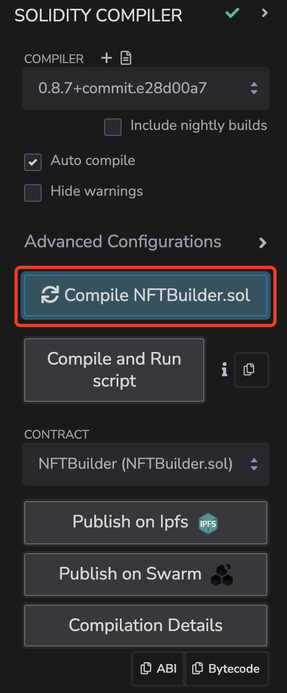
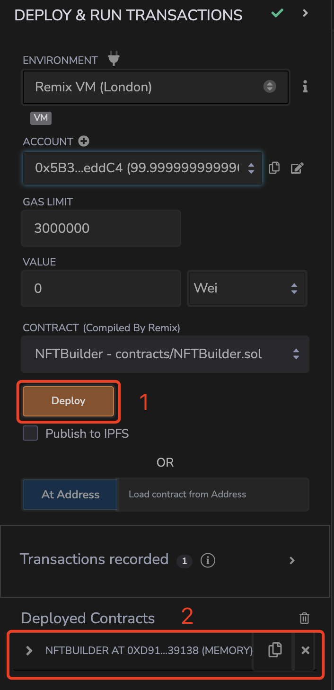
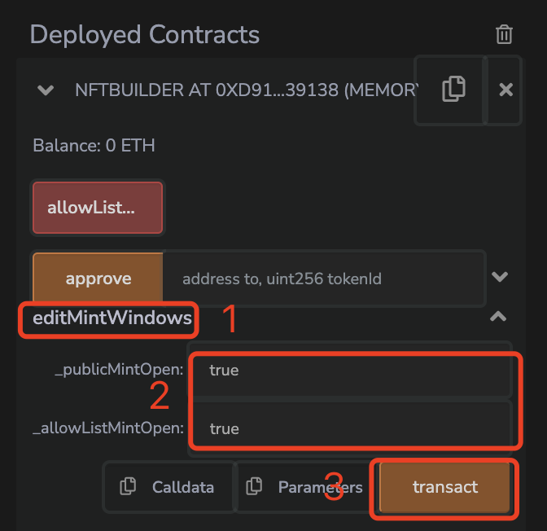
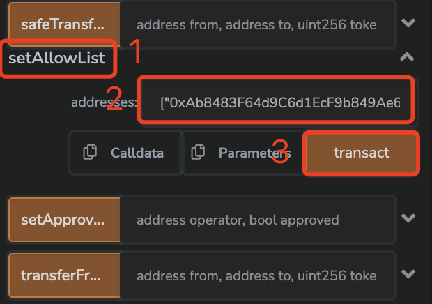
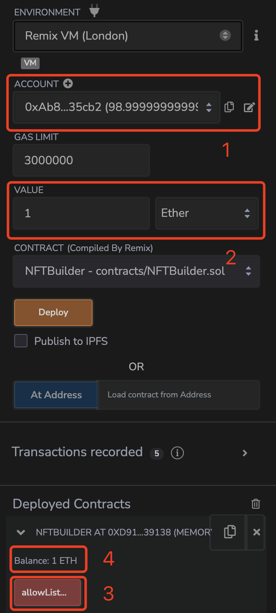
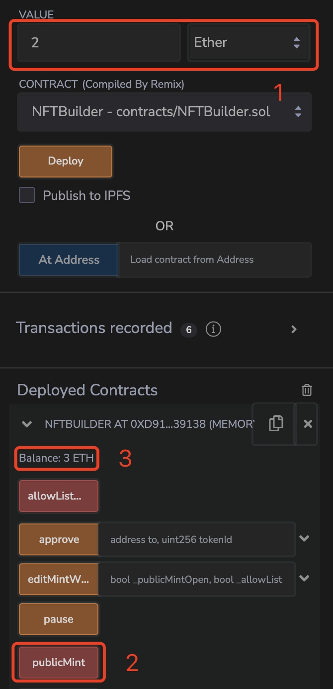
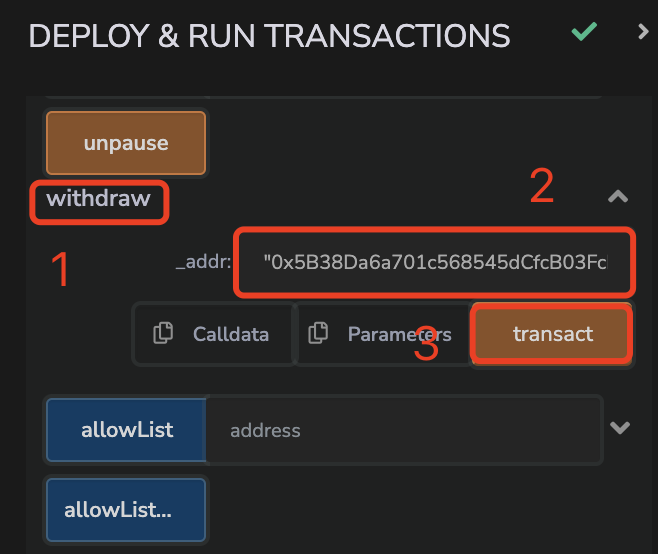
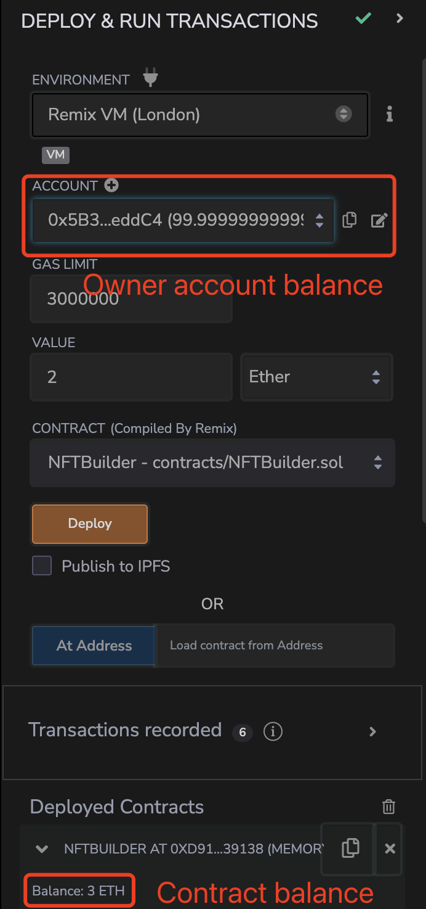
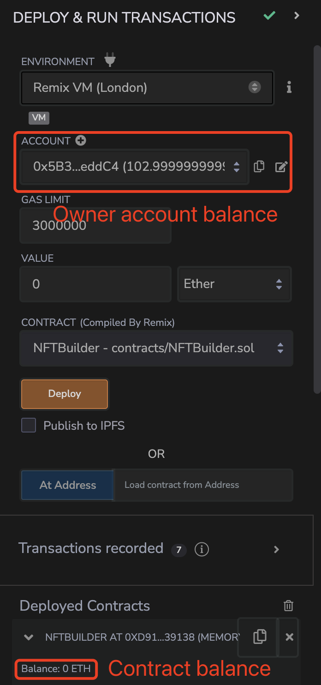

# NFT-builder

## Introduction

The NFTBuilder smart contract is used to build NFTs. It inherits from ERC721 Non-Fungible Token Standard.

This contract code can be **directly copied to Remix IDE for testing and deployment**.

The contract include 3 variables as following:

-   maxSupply (uint256): The maximum number of NFTs that can supply
-   publicMintOpen (bool): Control the Public Mint status
-   allowListMintOpen (bool): Control the Allowlist Mint status

The contract mainly implement the following functions for Buyer:

-   allowListMint(): Use for Allowlist Mint NFTs. Only the people in allowList allow to mint.
-   publicMint(): Use for Public Mint NFTs.
-   withdraw(address \_addr): Withdraw the money from the contract

And the following functions for Owner:

-   editMintWindows(bool \_publicMintOpen, bool \_allowListMintOpen): Update the mint status, edit the publicMintOpen and allowListMintOpen variables
-   setAllowList(address[] calldata addresses): Update the Allowlist

## User Guide

1. Copy the NFTBuilder into Remix IDE (https://remix.ethereum.org/), named "NFTBuilder.sol"

2. Compile the NFTBuilder.sol

 

     
 

3. Deploy & run transactions
 

     
 

4. Open Mint Windows. Update the mint status in "editMintWindows"

 

     
 

5. Set the Allowlist. Add whitelisted buyers' addresses into allowlist using "setAllowlist"

 

     
 

6. Allowlist Mint. Using "allowListMint" to mint NFTs with a VIP price (1 ETH). **First, we need to switch to a whitelisted Buyer account**. After successfully mint, you can see the Balance of the contract updated to 1 ETH.

 

     
 

7. Public Mint. Using "publicMint" to mint NFTs with a normal price (2 ETH). After successfully mint, you can see the Balance of contract updated to 3 ETH (1 ETH + 2 ETH).

 

     
 

8. Withdraw the money from the contract using "withdraw". Since this is an operation only for the Owner, we need to **switch back to the Owner account**. After withdrawing, the Balance of the contract decreased to 0 ETH, but the Balance of the owner account increased.

-   Steps

    

-   Result

    <b>Before Withdraw</b>
     
    

    <b>After Withdraw</b>
     
    

